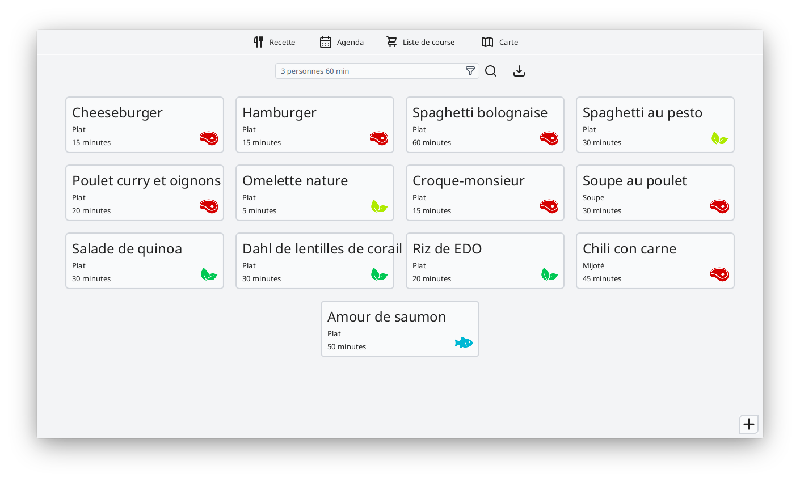
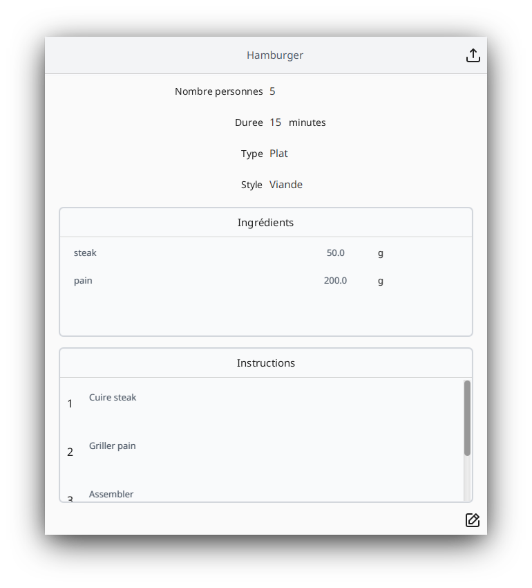
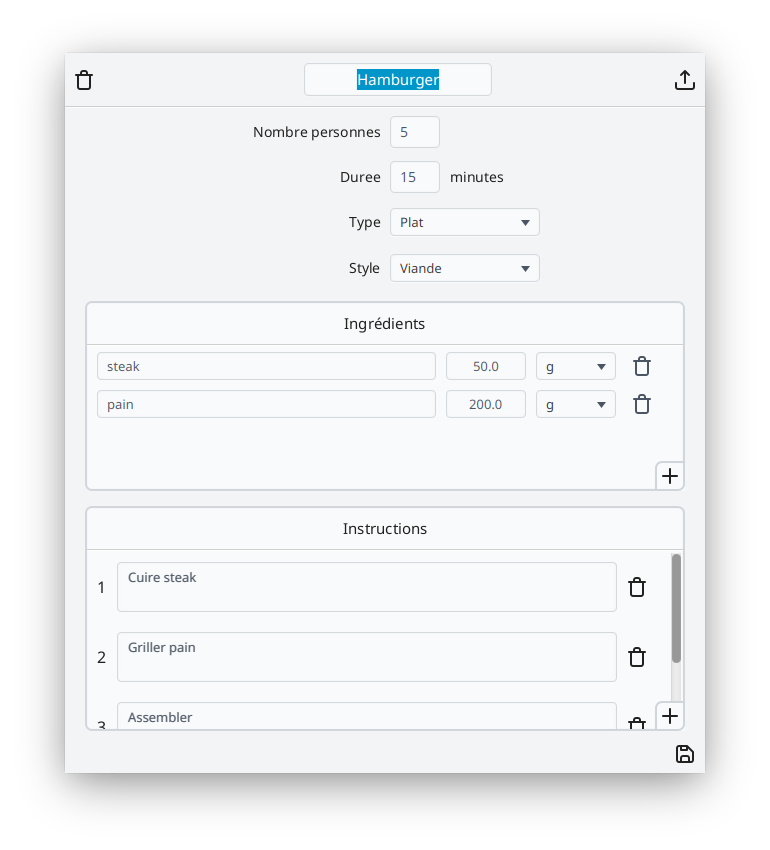
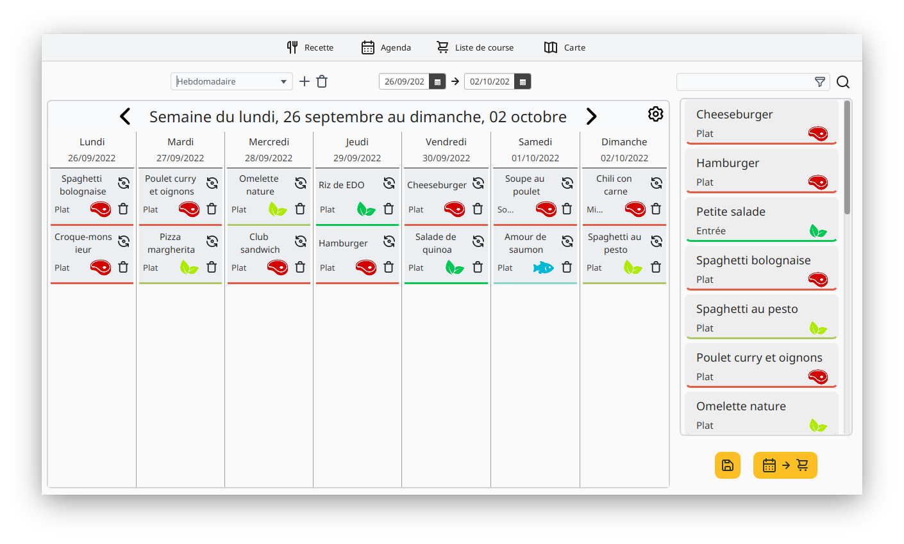
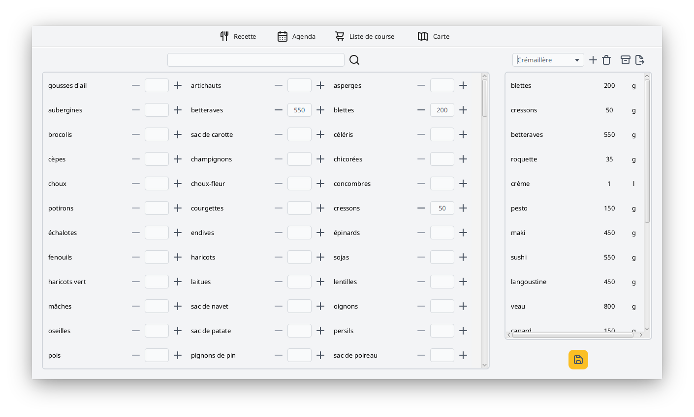
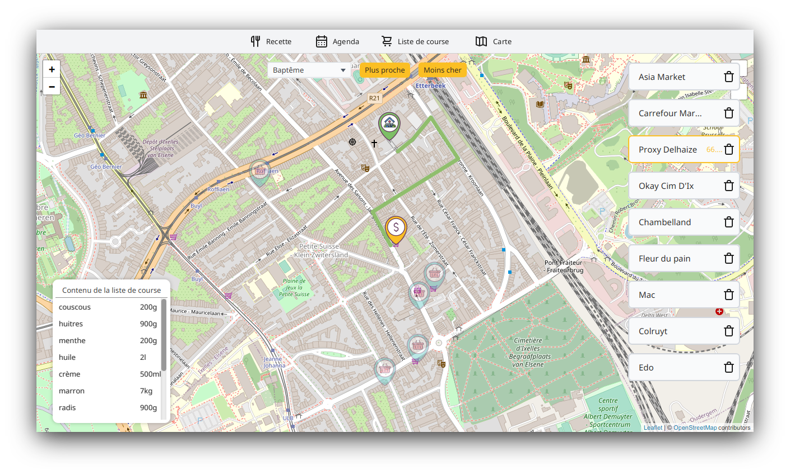
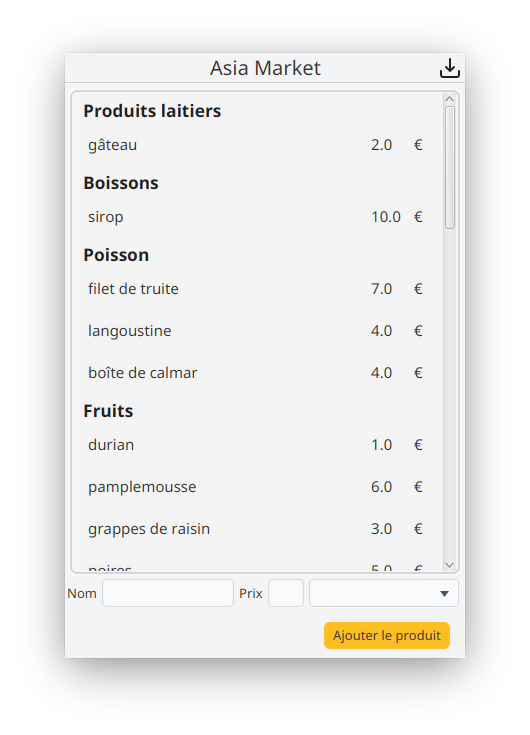

#  AutoChef 

## Grade : 17.5/20

## Authors
* **[sebaarte](https://github.com/sebaarte)**
* **[edgardocuellar](https://github.com/edgardocuellar)**
* **[adiscepo](https://github.com/adiscepo)**
* **[aedubois](https://github.com/aedubois)**
* **[mathleng](https://github.com/mathleng)**
* **[maluyckx](https://github.com/maluyckx)**
* **[etoome](https://github.com/etoome)**
* **[timarque](https://github.com/timarque)**
* **[vpiryns](https://github.com/vpiryns)**

## App
Our app is divided into 4 main parts : Recipe, Agenda, Shopping list and Map.

### Recipe
- Create, modify and delete recipes;
- Import your own recipes in JSON format;
- Filter recipes with search bar;

  

  
  

### Agenda
- Create, modify and delete agendas;
- Create, modify and delete menus;
- Drag and drop recipes and menus into your agenda;
- Generate an agenda based on your own criteria (date, number of meals per day, type of meal, etc.);
- Generate a shopping list based on an agenda;
- Filter recipes and menus with search bar;

  

### Shopping list
- Create, modify and delete shopping lists;
- Add products;
- Archive shopping lists;
- Export shopping list into pdf format;

  

### Map
- Add and delete stores on the map;
- Modify home location;
- Add products in a store by hand;
- Import product in a store via a csv file;
- Find the closest store that contains all products from a shopping list;
- Find the cheapest store that contains all products from a shopping list;
- Show the shortest path to a store;

  
  

## Libs
- JavaFX
- JUnit
- OpenCSV
- iText
- Leaflet

## Database
- Sqlite3

## Development Setup
- Java SDK 17 (OpenJDK), refer to your platform for proper installation (or use IntelliJ to do it)
- [Maven](https://maven.apache.org/install.html)

## Acknowledgements
Thanks to **Diane BRISON** for our logo and product category images.